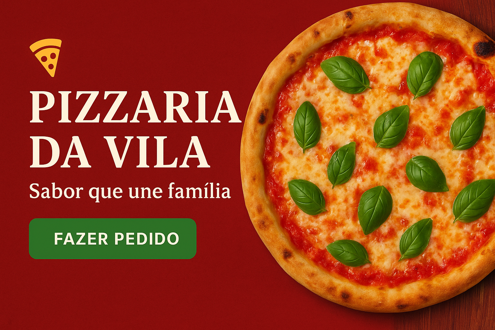

# 🍕 Pizzaria da Vila

Bem-vindo ao **Pizzaria da Vila**, o projeto definitivo para quem ama pizza e quer pedir com facilidade, estilo e rapidez! Este repositório traz um site moderno, responsivo e interativo para pizzarias, com cardápio dinâmico, resumo do pedido e validação inteligente de formulário.

---

## 🚀 Funcionalidades

- **Cardápio Dinâmico:** Sabores e bebidas renderizados automaticamente via JavaScript.
- **Resumo do Pedido:** Veja o total e os itens escolhidos em tempo real.
- **Formulário Validado:** Nome, telefone e endereço com validação e feedback instantâneo.
- **Layout Responsivo:** Perfeito em qualquer dispositivo, do celular ao desktop.
- **Banner Interativo:** Imagens e botão de ação para engajar o cliente.
- **Feedback Visual:** Confirmação de pedido e alertas usando SweetAlert2.

---

## 📸 Preview

<div align="center">
  
</div>

---

## 🛠️ Estrutura do Projeto

```
Site_pizzaria/
├── index.html
├── css/
│   └── style.css
├── js/
│   └── script.js
├── image/
│   ├── banner.png
│   ├── bemvindo.png
│   └── pizza.png
└── README.md
```

- **index.html:** Página principal do site.
- **css/style.css:** Estilos modernos e responsivos.
- **js/script.js:** Lógica do cardápio, resumo e validação.
- **image/**: Imagens para banner e pizzas.

---

## 💻 Como rodar

1. Clone este repositório:
   ```sh
   git clone https://github.com/seuusuario/pizzaria-da-vila.git
   ```
2. Abra o projeto no **VS Code**.
3. Use a extensão **Live Preview** ou um servidor local para visualizar o `index.html`.
4. Aproveite e faça seu pedido!

---

## ✨ Tecnologias

- **HTML5**
- **CSS3**
- **JavaScript ES6**
- [SweetAlert2](https://sweetalert2.github.io/) para alertas

---

## 📄 Licença

Este projeto está sob a licença MIT. Veja [LICENSE](LICENSE) para mais detalhes.

---

Feito com ❤️ por Reynanz.  
Se gostou, deixe uma estrela ⭐ e compartilhe com os amigos pizzaiolos!
